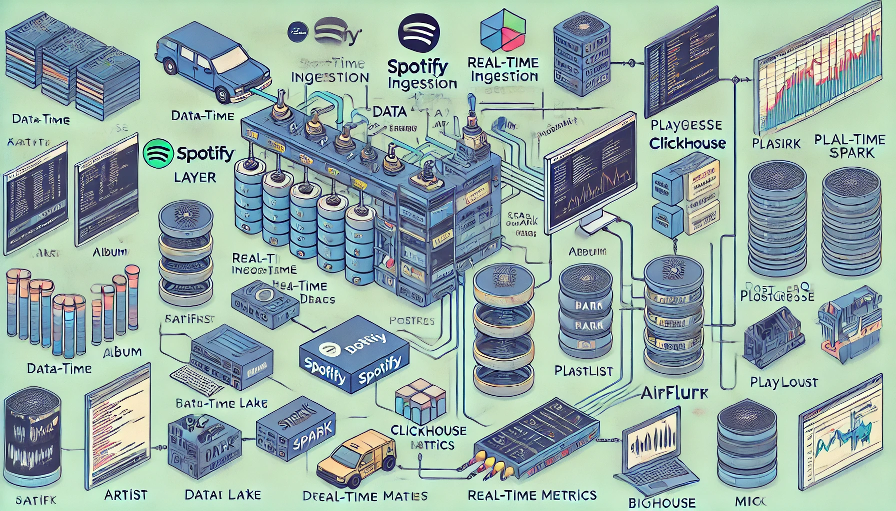
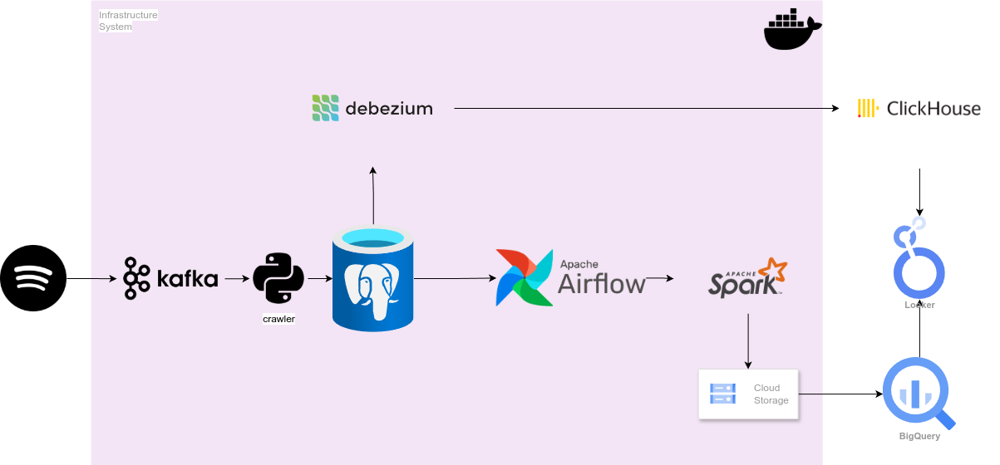
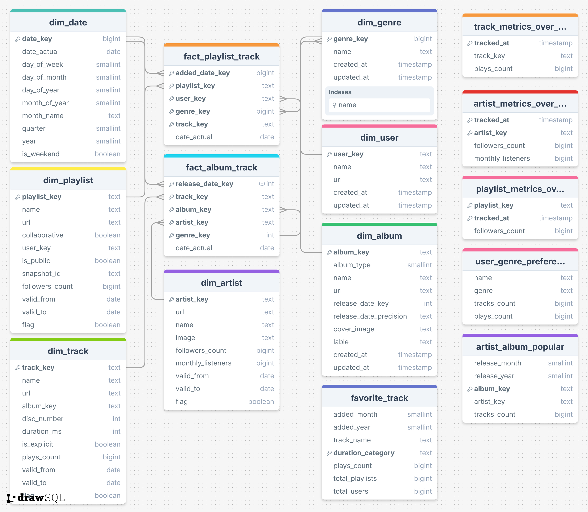

# Spotify Analysis End to End Project



## **Table of Contents**
- [Project Overview](#project-overview)
  - [Key Objectives](#key-objectives)
  - [Highlights](#highlights)
- [Architecture Diagram](#architecture-diagram)
- [Tech Stack](#tech-stack)
  - [Data Ingestion](#data-ingestion)
  - [Data Storage](#data-storage)
  - [Data Processing](#data-processing)
  - [Orchestration](#orchestration)
  - [Infrastructure](#infrastructure)
- [Dataset](#dataset)
  - [Album](#album)
  - [Artist](#artist)
  - [Playlist](#playlist)
  - [Track](#track)
- [Data Model](#data-model)
- [Getting Started](#getting-started)
  - [Prerequisites](#prerequisites)
  - [Installation](#installation)
  - [Running the Project](#running-the-project)

## Project Overview

The **Spotify Music Analysis** project is a comprehensive end-to-end data engineering solution designed to analyze Spotify artist, album, playlist and track data. This project integrates modern data engineering tools and practices to create a scalable, reliable, and automated pipeline for processing, transforming, and analyzing music-related data.

The project focuses on two parts:

* Ingesting data from Spotify by utilizing a **crawler process** that interacts with Spotify's Web API to retrieve raw data. This crawler operates within a Kafka-based architecture. The retrieved raw data is subsequently stored in PostgreSQL, serving as a staging area for further transformations.

- Ingesting data from Spotify, storing it in a data lake, transforming it for analytical purposes, and finally loading it into a star-schema data warehouse for reporting and insights. This enables data-driven decision-making for various use cases, such as understanding user preferences, tracking artist and playlist popularity, and monitoring song trends over time.

### Key Objectives

- Build the **data crawler system** and the **ETL pipeline** for Spotify data.
- Enable **real-time and batch processing** using Kafka and Spark.
- Store and process data using **BigQuery** for analytical queries and **Clickhouse** for real-time metrics.
- Automate workflows with **Airflow** for seamless task scheduling and orchestration.

### Highlights

- **Data Sources**: Spotify Web API and crawlers.
- **Data Storage**: MinIO as a data lake, BigQuery for analytics, and Clickhouse for real-time metrics.
- **Data Processing**: Apache Spark for distributed data processing and transformation.
- **Orchestration**: Apache Airflow for task scheduling and dependency management.
- **Message Streaming**: Apache Kafka for real-time ingestion and event-driven processing.
- **Infrastructure as Code**: Terraform for cloud resource management and scalability.

This project showcases a modern data engineering architecture and provides a foundation for exploring deeper insights into music data.

## Architecture Diagram



## Tech Stack

### Data Ingestion
   - **Spotify Web API**: Source of raw music-related data (artists, tracks, playlists, etc.).
   - **Apache Kafka**: Message broker for real-time ingestion and streaming data pipelines.

### Data Storage
   - **PostgreSQL**: Staging area for raw data retrieved from crawlers.
   - **GCS**: Data lake for raw and intermediate data, providing S3-compatible object storage.
   - **Clickhouse**: Analytical database for real-time metrics and fast querying.
   - **BigQuery**: Cloud-based data warehouse for star schema analytics and large-scale queries.

### Data Processing
   - **Apache Spark**: Distributed ETL tool for transforming and processing large-scale data.

### Orchestration
   - **Apache Airflow**: Workflow management and orchestration for scheduling ETL pipelines.

### Infrastructure
   - **Docker & Docker Compose**: Containerization and orchestration of services for local development.
   - **Terraform**: Infrastructure-as-Code (IaC) for managing cloud resources.

## Dataset

The dataset comprises the following key entities from Spotify:

### Album
   - **Description**: A collection of tracks released together, such as an album, single, or compilation.
   - **Attributes**:
     - Name of the album (e.g., "Thriller").
     - Type of album (single, album, compilation).
     - Release date and release precision (e.g., year, month, or day).
     - Label or publisher of the album.
     - Cover image URL.
     - Relationship to associated artists and tracks.

### Artist
   - **Description**: A creator of music, such as a solo musician, band, or producer.
   - **Attributes**:
     - Name of the artist (e.g., "Taylor Swift").
     - Genres associated with the artist (e.g., pop, rock).
     - Popularity score (0-100) based on Spotify's metrics.
     - Number of monthly listeners.
     - Follower count on Spotify.
     - Relationship to albums and tracks created by the artist.

### Playlist
   - **Description**: A curated collection of tracks created by users or Spotify for specific purposes (e.g., moods, themes, or genres).
   - **Attributes**:
     - Playlist name and description.
     - Snapshot ID (versioning identifier for changes in the playlist).
     - Owner information (e.g., user ID or Spotify).
     - Number of followers for the playlist.
     - Tracks included in the playlist and relationships to users.

### Track
   - **Description**: An individual piece of music, such as a song or instrumental.
   - **Attributes**:
     - Name of the track (e.g., "Shape of You").
     - Duration in milliseconds.
     - Explicit flag (whether the track contains explicit content).
     - Popularity score (0-100) reflecting the track's popularity on Spotify.
     - Play count (number of times the track has been played, if available).
     - Relationships to albums, artists, and playlists containing the track.

## Data Model

The data model for this project is designed using a star schema to facilitate efficient querying and analytics. It consists of **dimensions** and **fact tables** that store processed and transformed data from Spotify.


## Getting Started

Follow these steps to set up and run the Spotify Music Analysis project locally.

---

### Prerequisites

Ensure you have the following installed on your system:
- **Docker**: For running containerized services.
- **Docker Compose**: For managing multi-container setups.
- **Python 3.11+**: For running the project’s backend and ETL scripts.
- **Terraform**: For managing infrastructure as code (optional, for cloud deployment).
- **Spotify Developer Account**: Required to generate API credentials.

---

### Installation

1. **Clone the Repository**:
   ```bash
   git clone https://github.com/loinguyen3108/sportify-music-analysis.git
   cd sportify-music-analysis
   ```

2. **Set Up Environment Variables:**:
   - Create a .env file in the root directory and configure the following variables:
    ```bash
    SPOTIFY_CLIENT_ID=<your_spotify_client_id>
    SPOTIFY_CLIENT_SECRET=<your_spotify_client_secret>
    POSTGRES_USER=spotify
    POSTGRES_PASSWORD=spotify
    ```

3. **Build Docker Images and download jars:**
    ```bash
    make download-spark-jars
    make build-airflow
    make build-spark
    ```

4. **Install Python Dependencies:**
   ```bash
   make deps
   ```

### Running the Project
1. **Start Docker Services:**
   ```bash
   docker-compose up -d
   ```

2. **Run the Spotify Crawler:**
   - Authenticate with Spotify API
   ```bash
   python src/cli/auth.py -u <your_username>
   ```
   - Ingest and consume data
   ```bash
   python src/cli/ingest.py --help
   python src/cli/consumer.py --help
   ```
   - Monitor data by tag
   ```bash
   python src/cli/monitor.py --help
   ```
